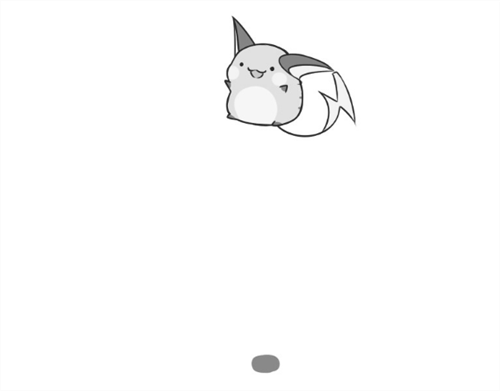

# 🌟 Hi 👋 Welcome to my GitHub 

## I’m **Suryadeep Singh**

    

---

### 👀 I’m interested in:

    - 🔧 **Software Development** 
    - 📱 **App Development** 

### 🌱 I’m currently learning:

    - 💻 **C++** 
    - 📚 **Kotlin** 
    - 🎨 **Frontend Development** 

### 💞️ I’m looking to collaborate on:

    - 🌍 **Open-source projects** 
    - 📖 **Educational platforms** 
    - 🛠️ **Development projects** 

### 📫 How to reach me:

    - 📧 Email: <a href="mailto:surya01785@gmail.com">click</a> 
    - 🔗 LinkedIn: 

---

### 😄 Pronouns:
- **He/Him**

## ⚡ Fun fact:
I enjoy solving puzzles and exploring new technologies!

---
 
## My Project

    

---
